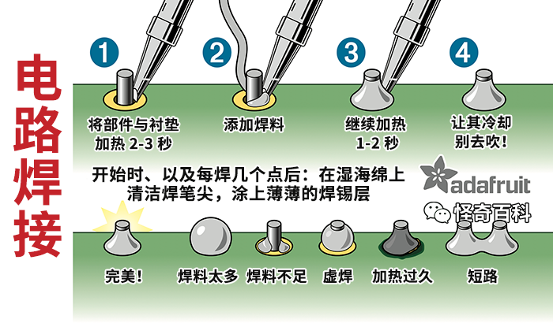

# 实验零：组装实验平台

## 平台的组成

我们向同学们提供一套针对本课程量身打造的开发板，核心部分为[立创·地阔星 STM32F103C8T6 开发板](https://lckfb.com/project/detail/lckfb-dkx-stm32f103c8t6)，搭配若干其他芯片、按钮、指示灯等外围设备，以满足实验需求。

【画大饼】：架构图

:::info{title=表述的约定}

如无特殊说明，后续的`开发板`均指由我们设计的电路板。为了便于区分，可简称`立创·地阔星 STM32F103C8T6 开发板`为`最小系统板`。

:::

## 物料清单

物料清单，英文表述为 Bill of Materials，业内常简称为 BOM。本课程配套的开发板需要同学们自行组装，建议同学们在拿到相关物料后先进行清点确认。

【画大饼】：BOM 表

## 器件的焊接

焊接是一门手艺活。本实验需要同学们使用烙铁自行焊接好所有的器件，没有焊接经验的同学建议先在网络上自行学习相关知识再动手。焊接需要使用高温，请同学们注意保护自己和他人的人身安全。

:::tip{title=概念解释}

- `焊盘`：元件与电路导通的金属连接点。
- `直插元件`：带长金属引脚的元件，焊接时将引脚插入 PCB 孔后焊接。
- `贴片元件`：较为扁平、无引脚或引脚极短的元件，焊接时将元件放置于焊盘上后焊接。

:::

:::tip{title=焊接知识}

需要同学们自行搜寻和学习，例如[《烙铁焊接速通教程_锡焊速成教学(含元器件引脚识读、拆焊)》](https://www.bilibili.com/video/BV1vq3KeAEmC)，以及下面的一张关于直插元件焊接的图片。

以上内容仅作为示例和参考。

:::

【画大饼】：焊接顺序推荐

:::danger{title=不要着急上电}

为了保障人身和财产安全，焊接完成后不要立即连接电源，应当按照后面的指引先进行短路测试。

:::

## 最终效果

【画大饼】：开发板 3D 渲染图或实物照片

## 测试

首先，使用万用表测量电源与地之间是否存在短路。我们在开发板右下角设计了 3 个测试点可供测量，使用万用表的通断档或电阻档分别测量 `+5V` 和 `VCC/3.3V` 对 `GND` 是否短路。如果测量结果为万用表发出蜂鸣或电阻很小，则说明系统中存在短路，需要找到焊接错误的地方并进行修复。

然后，使用 ST-Link 调试器连接开发板，具体做法是使用 4 根杜邦线将最小系统板下方的 4 个排针连接到 ST-Link 调试器上的对应针脚上，以针脚的名字相同或相似为准。连接完毕后再三检查是否正确。

最后，将调试器连接到电脑，然后按照我们提供的测试程序包中的说明，将测试程序下载到芯片中运行，并检查是否能够正确运行。

## 接下来

安装一款合适的 [IDE](../reference/ide.md)，自由探索，开启你的 STM32 学习之旅。不要忘记我们提供的[参考文档](../reference/index.md)。
