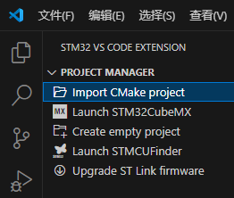
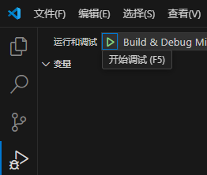
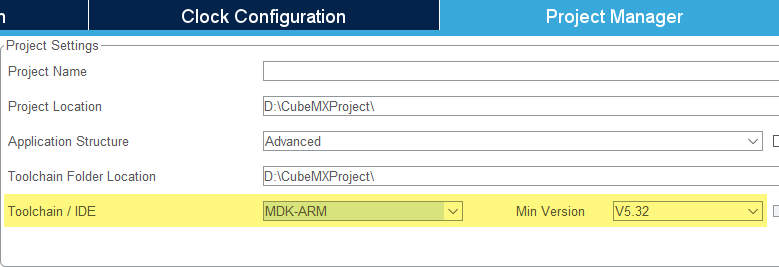

# 集成开发环境 IDE

在本课程中，我们使用 C 语言编写程序，并将程序下载到 STM32 芯片中运行。我们编写的 C 语言程序代码会经历**预处理**、**编译**、**汇编**、**链接**等流程变为单个**可执行文件**，这个过程我们称之为**构建**（Build）。将构建出来的可执行文件中的二进制代码写入 STM32 芯片中的存储器的过程，我们称之为**下载**（Download）或者**烧录**（Flash）。

STM32 平台的**集成开发环境**（Integrated Development Environment，IDE）是一种软件工具，提供代码编辑、构建、版本控制等基本功能，同时也集成了下载和调试等功能，为程序开发的全流程提供便利。

:::tip

对软件开发环境没有任何了解或没有特别要求的同学，推荐选择选项一。

追求编码体验并且熟悉操作系统使用的同学，推荐选择选项二。

:::

## 选项一：STM32CubeIDE

STM32CubeIDE 是意法半导体官方推出的一款基于 Eclipse 的集成开发环境，专门用于 STM32 系列芯片的开发。STM32CubeIDE 集成了 STM32CubeMX，可以帮助我们生成工程代码，并提供了丰富的代码模板和示例代码。

### 下载和安装

在意法半导体官方网站上直接免费下载：<https://www.st.com.cn/content/st_com/zh/stm32cubeide.html>

:::warning{title=谨慎修改软件的安装目录}

建议安装在默认位置。如果系统盘可用空间确实不足，需要更改安装磁盘，建议直接修改安装路径输入框中的盘符。例如，直接将路径开头的 `C:` 修改为 `D:`。

:::

安装完成后，启动 STM32CubeIDE，会提示选择一个目录作为工作空间。工作空间用于存放工程文件和软件配置等数据，可根据实际需要选择或者直接使用默认位置。

进入软件主界面后，可以注意到窗口右下角时不时会出现带有网址的进度条，这是软件首次启动后自动在线更新相关资源。此过程可能比较缓慢，需要耐心等待，但不需要人工值守和干预。

随后，在软件菜单栏中点击 `Help` -> `STM32Cube updates` -> `Connection to myST`。完成账号登录后，再点击 `Help` -> `Configuration Tool` -> `Manage Embedded Software Packages`，安装所需的设备固件包。我们使用 `STM32F103C8T6` 芯片，所以需要安装 `STM32F1` 软件包。

安装后的初始配置到此完成。

## 选项二：Visual Studio Code

Visual Studio Code 本身作为一个代码编辑器，并没有内置 STM32 平台开发能力，需要搭配 STM32CubeMX、STM32CubeCLT 以及 STM32 VS Code Extension 等工具使用。

### 下载和安装

此处仅提供相关链接，不作详细说明，请自行探索。

- [Visual Studio Code](https://code.visualstudio.com/)
- [STM32CubeMX](https://www.st.com.cn/content/st_com/zh/stm32cubemx.html)
- [STM32CubeCLT](https://www.st.com.cn/zh/development-tools/stm32cubeclt.html)
- [STM32 VS Code Extension](https://marketplace.visualstudio.com/items?itemName=stmicroelectronics.stm32-vscode-extension)

### 使用

首次使用 STM32 VS Code 扩展会提示配置相关软件的路径，根据提示操作即可。

与选项一相比，需要使用 STM32CubeMX 软件创建项目，并配置为生成 CMake 工程。随后，在 VS Code 的侧栏中切换到 STM32 面板，选择导入 CMake 项目，即可打开。切换到调试面板，点击开始调试按钮，即可进行程序的构建、下载调试。

| 导入 CMake 项目 | 调试 |
| --- | --- |
|  |  |

## 选项三：Keil μVision

一些较老的教程可能会使用 Keil MDK-ARM 作为 IDE。如果你喜欢这款软件，它也是能够用于本实验教程的。

### 下载和安装

软件的激活不在教学范围内。

- [MDK-ARM v5](https://www.keil.com/mdk5)
- [STM32CubeMX](https://www.st.com.cn/content/st_com/zh/stm32cubemx.html)

### 使用

在 STM32CubeMX 软件中创建项目，并配置为生成 MDK-ARM 工程即可，根据实际情况调整目录和版本。生成完成后，目录中存在 Keil μVision 工程文件，直接打开即可。

## 其他选项

没有人限制你必须遵循上面的说明！你可以自由探索自己喜欢的开发方式，以下是一些可能有所帮助的链接。

- <https://github.com/STMicroelectronics/cmsis-core>
- <https://github.com/STMicroelectronics/STM32Cube_MCU_Overall_Offer>
- <https://github.com/STMicroelectronics/STM32CubeF1>
- <https://em-ide.com/>
- <https://platformio.org/>
