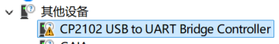
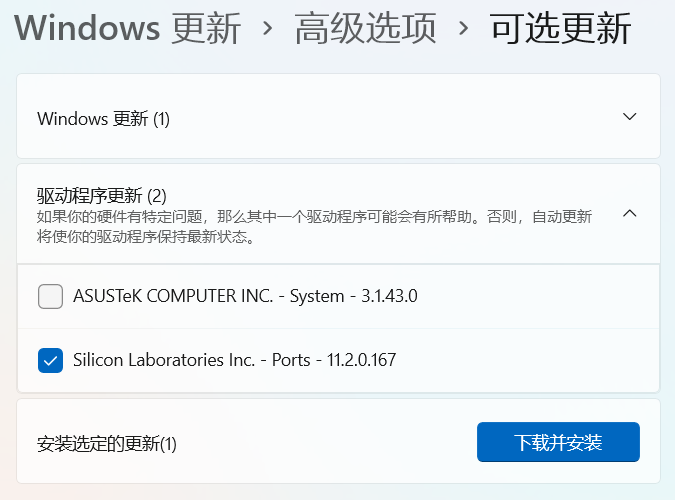
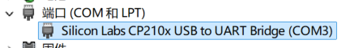

# 通过 Windows 更新安装驱动

:::tip

可以通过右键点击任务栏上的“开始”按钮打开设备管理器。

:::

以 CP2102 USB 转 TTL 模块为例，首次连接到计算机时，在设备管理器中查看，会显示为未知设备。

**此时，只需要打开系统设置，进入 Windows 更新模块，点击检查更新。**设备驱动程序有可能会被自动安装，也有可能会出现在可选更新列表中。如果没有观察到驱动安装，则可以进入可选更新列表，勾选相应的驱动程序并安装。

安装成功后，设备管理器中即显示为正常状态。

