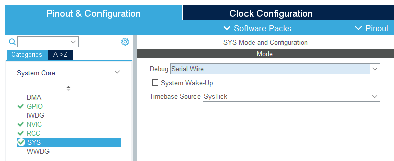
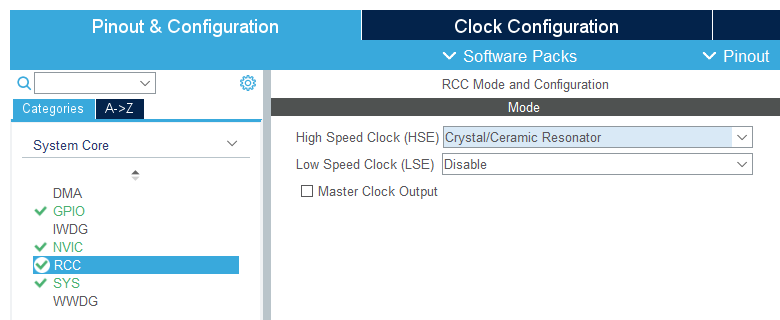
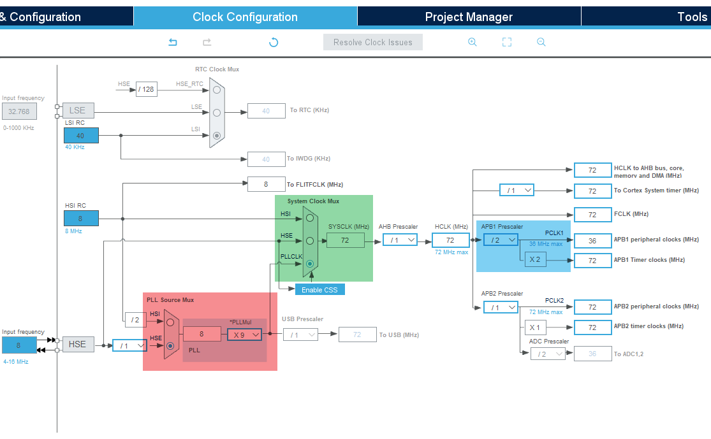

# 项目基本配置

:::note

无论是使用 STM32CubeIDE，还是使用 STM32CubeMX，以下的内容都是通用的，因为 STM32CubeIDE 内置了 STM32CubeMX。

:::

此页介绍了使用本实验课程开发板时 STM32CubeMX 项目的基本配置。

## 型号

请牢记我们使用的开发板搭载 [STM32F103C8T6](https://www.st.com.cn/zh/microcontrollers-microprocessors/stm32f103c8.html) MCU。

## 调试端口

在系统选项中选择使用串行调试端口。

:::warning{title=避免疏漏}

应当多多留心检查此选项，错误的设置会使 MCU 正常运行时无法使用调试器连接。

如果不幸下载了错误配置调试端口的程序，应先修正调试端口配置，然后按照[这里的说明](./boot-mode)临时改变启动模式，下载正确的程序。

:::

## 时钟

首先在复位和**时钟控制**（RCC）选项中将**高速外部时钟信号**（HSE）模式设为晶体振荡器。

随后在时钟树页面参考下图进行配置。

可以按照如下 3 步进行操作和理解。

1. 红色部分：首先将锁相环信号来源设为 HSE，最大 9 倍频，得到 72 MHz 的时钟信号。
2. 绿色部分：将系统时钟来源设为锁相环输出。
3. 蓝色部分：`PCLK1` 最大频率为 36 MHz，因此需要对 72 MHz 进行至少 2 分频。

:::tip{title=思考题}

为什么要这样配置？如果不进行额外配置，使用默认配置，会有什么效果？

:::
