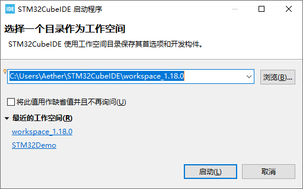
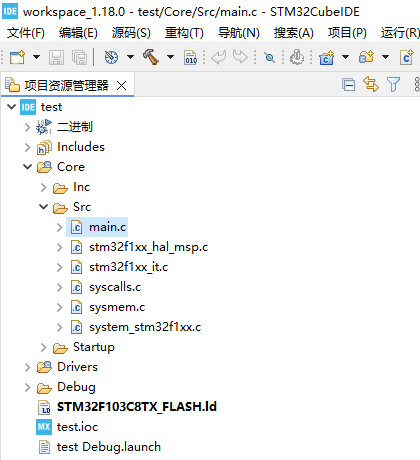
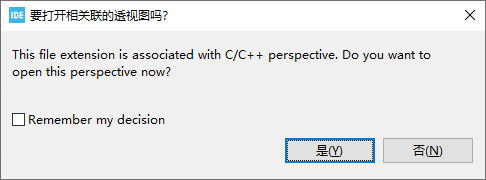
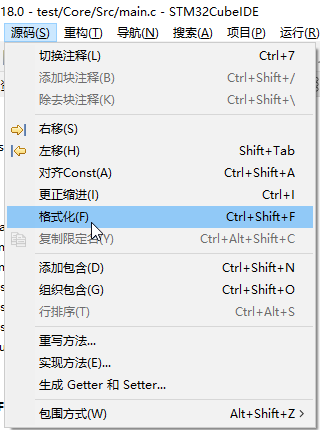
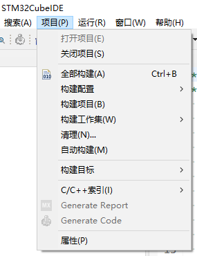
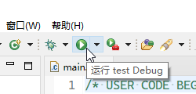
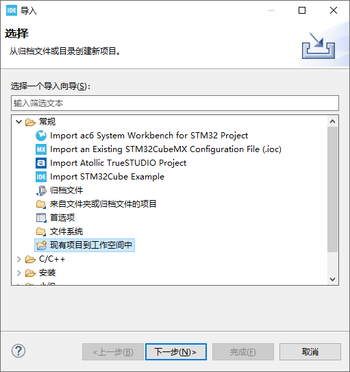

# STM32CubeIDE 基本使用

在 [STM32CubeIDE 专题页面](https://www.st.com.cn/content/st_com/zh/stm32cubeide.html)上有一系列用户文档和视频教程，比较准确和权威。

下面介绍一些基本概念和操作，仅供快速入门和参考。

## Eclipse 简体中文本地化

如果你更喜欢简体中文用户界面，可以以 `Eclipse`、`中文`、`汉化`等关键词在互联网上搜索相关教程。

提示：可以使用 [Eclipse 软件仓库镜像](https://help.mirrors.cernet.edu.cn/eclipse/)加速软件包下载。

## 工作空间

存放代码和配置的位置，建议选定一个短的、纯 ASCII 字符的路径，存放本课程所有相关项目。

启动时会弹出选择窗口，如果不小心勾选了不再询问，可以在菜单栏中点击 `文件` -> `切换工作空间`。

## 项目资源管理器

一个树状图，类似文件管理器。一个基本的项目结构如下图所示。

打开 `.ioc` 文件可以进入该项目对应的 STM32CubeMX 界面，如果有更改，保存时应当会提示是否需要生成代码。如果没有，则可以在菜单栏中点击 `项目` -> `Generate Code` 立即执行代码生成。阅读[项目基本配置](./mx-project.md)了解适用于本实验开发板的最小配置。

所有核心代码（亦或用户自行编写的代码）放在 `Core` 文件夹中，其中 `Src` 文件夹存放 C 源文件（`.c`），`Inc` 文件夹存放 C 头文件（`.h`）。

## 透视图

Eclipse 软件窗口的布局，可以使窗格的大小和内容适应当前进行的工作类型。可以在窗口右上角手动切换。默认情况下总是会弹窗询问是否需要切换，可能会比较烦人。

## 格式化和更正缩进

自动整理代码格式（排版）。

## 构建和清理

`项目`菜单里有构建和清理选项，分别对应将代码编译和将编译产物删除。通常不需要使用这两个动作，因为进行运行动作时会自动触发构建，清理用于修改编译参数后或编译缓存异常等场景。

## 运行和调试

工具栏中有一个播放图标的按钮，对应运行动作，点击后会将程序下载到芯片中直接运行。旁边的瓢虫（Bug）图标按钮对应调试（Debug）动作。

每个项目首次运行时会提示创建配置，如果使用 ST-Link 调试器连接则直接确定即可。

下载程序比较慢，应当留意窗口下方的输出信息。

## 调试控制

进入调试模式后，工具栏中会出现一排控制按钮，如下所示。

- `终止并重新启动`：停止当前调试，然后再启动调试。
- `继续`：继续执行程序。
- `暂挂`：暂停程序执行。
- `终止`：停止当前调试。
- `断开连接`：断开调试器连接。
- `单步跳入`：进入函数调用。通俗理解是进入即将执行的函数的内部。
- `单步跳过`：跳过函数调用。通俗理解是跳到下一行。
- `单步返回`：返回函数调用。通俗理解是跳回上一层函数。

## 添加现有项目到工作空间中

有时候可能会因为某些原因需要将一个项目添加到项目资源管理器中，这可以通过右键点击项目资源管理器空白处，选择`导入...`，然后选择`现有项目到工作空间中`实现。

